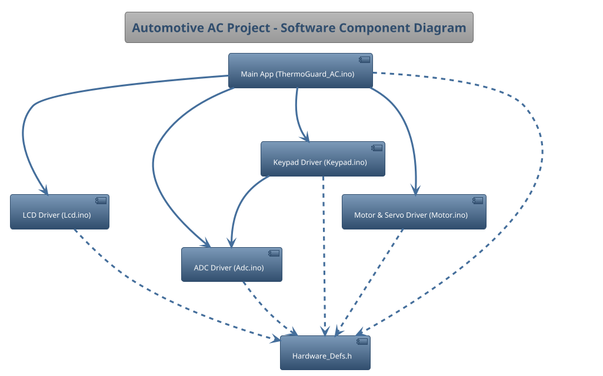
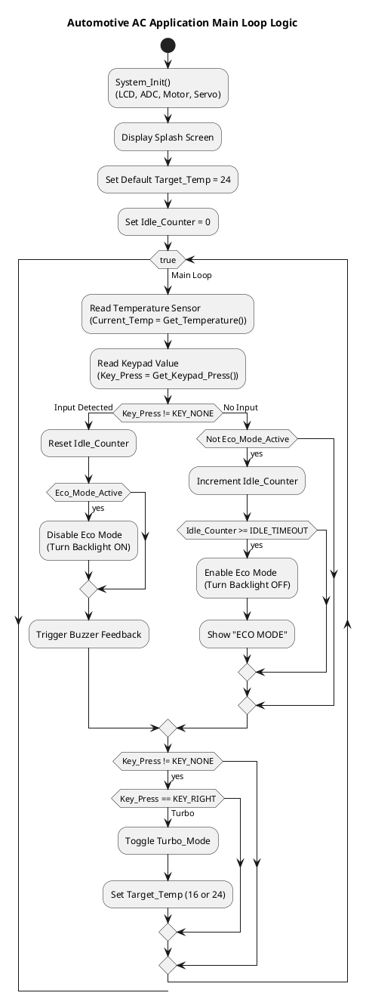
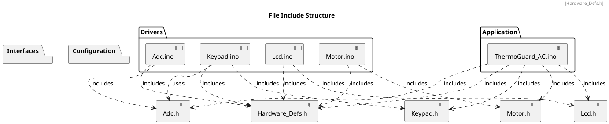

# ThermoGuard AC

| **Author**              | `Ali Akram - Mahmoud Adgham - Ziad Khalil`                                       |
|:------------------------|:-----------------------------------------------------|
| **Status**              | `Release`                          |
| **Version**             | `1.0`                                                |
| **Date**                | `9/12/2025`                                         |

## Introduction

This document provides the detailed software design for the "Automotive Air Conditioning Control Panel" (ThermoGuard) project. This system is developed for the AVR ATmega328P microcontroller as part of the KH5023FTE Embedded System Design & Development module.

### Purpose

This project aims to build a reliable electronic system that functions as a complete automotive air conditioning control panel. It serves as the central processing unit that links user inputs to the physical cooling hardware. The system has four main goals:

1.  **Monitor and Display:** The system will constantly measure the current ambient temperature using an analog sensor (ADC) and clearly show the temperature, system status, and animations on the LCD screen.
2.  **Allow User Configuration:** The system will watch the KeyPad for button presses to adjust the Target Temperature, toggle "Turbo Mode" (Max Cooling), and toggle "Swing Mode" (Air Flow Distribution).
3.  **Regulate Temperature:** The system will automatically control the Fan (Motor) speed and direction to adjust the environment until it matches the temperature the user requested.
4.  **Safety & Efficiency:** The system will monitor for critical overheating to trigger emergency shutdown procedures and dim the display (Eco Mode) during periods of inactivity to save power.

### Scope

According to the project brief and the architectural requirements, this detailed design's scope is limited to three primary use cases that cover environmental control, safety, and user interaction:

**`Use Case #1`: Climate Monitoring and Automated Control**
The system will continuously acquire and process ambient temperature data using the ADC module. It will take the digitized value, convert it to degrees Celsius, and display the result. Simultaneously, the system will automatically regulate the DC Fan Motor's speed and direction. It also manages a Servo Motor to oscillate air vents (Swing Mode) when requested.

**`Use Case #2`: User Configuration**
The system will monitor the KeyPad for user input. It allows the user to configure the Target Temperature (Up/Down), toggle "Turbo Mode" for instant cooling (Right Key), and toggle "Swing Mode" for air distribution (Left Key).

**`Use Case #3`: Safety and Energy Management**
The system monitors for critical failure states. If the temperature exceeds 50°C, it triggers an "Emergency Shutdown" (Alarm + Max Fan + Halt). Additionally, if no user input is detected for a set duration, the system enters "Eco Mode" by turning off the LCD backlight.

Native C programming must be used to complete the project; no external libraries or Arduino-based code may be used.

## Architectural Overview

This section describes where this module resides in the context of the software architecture

## Assumptions & Constraints
### Assumptions
* **Microcontroller:** The code is written for an **AVR ATmega328P** microcontroller.
* **System Clock:** The system clock frequency (`F_CPU`) is **16MHz**. This is critical for `_delay_ms()` timing and the ADC prescaler settings.
* **Hardware Connections:**  All components (LCD, DC Motor, Servo, Keypad, LM35, Buzzers) are connected to the exact ports and pins defined in `Hardware_Defs.h`.
* **ADC Configuration:** The ADC uses AVcc for Keypad reading, but switches to the internal 1.1V reference for the LM35 Temp Sensor to ensure precision.
* **Servo Timing:** The Servo motor is controlled via software PWM nested inside the main loop timing to avoid conflicts with the Motor PWM timer.

### Constraints

## Functional Description

#### Application Logic Flow

## Implementation of the Module

The project is broken into several key modules:

* **`ThermoGuard_AC.ino`**: Contains the System_Init() and main() loop, global variables for state management (Eco, Turbo, Emergency), and all high-level application logic.
* **`Adc.ino`**: Implements the ADC driver.
    * `Adc_Init()`: Configures the ADC hardware settings (Prescaler and Reference).
    * `Get_Temperature()`: Configures the ADC for Channel 2 using the 1.1V internal reference, averages 20 samples, and returns the temperature in Celsius.
    * `Adc_Read()`: Selects the specified channel, starts a conversion, polls the `ADSC` bit until the conversion is complete, and returns the 10-bit result.
* **`Lcd.ino`**: Implements the 16x2 LCD driver in 4-bit mode.
    * `Lcd_Init()`: Performs the required 4-bit initialization sequence and enables the backlight pin.
    * `Lcd_Send_Command() / Lcd_Send_Data()`: Internal helper functions to send commands and data, respectively, by manipulating the control pins.
    * `Lcd_Load_Custom_Chars()`: Loads custom characters (Fan animations and Degree symbol) into the LCD memory.
* **`Keypad.ino`**: Implements the analog keypad driver.
    * `Get_Keypad_Press()`: Reads the raw 10-bit ADC value from the keypad channel. It then compares this value against the thresholds defined in `Hardware_defs.h` to identify and return the pressed key.
* **`Motor.ino`**: Implements the DC Motor and Servo driver.
    * `Motor_Init()`: Configures the PWM timer registers and sets the direction and servo pins as outputs.
    * `Motor_SetSpeed()`: Controls the speed of the fan by updating the PWM duty cycle based on the temperature error.
    * `Servo_Send_Pulse()`: Manually modulates the servo signal pin to create precise pulses for the air swing mechanism.

## Integration and Configuration
### Static Files
All source and header files that comprise the project are listed below.

| File name | Contents |
|:---|:---|
| `ThermoGuard_AC.ino` | Main application logic, safety monitoring, and servo timing loop. |
| `Hardware_Defs.h` | Central definitions for all hardware pins, ports, ADC thresholds, and system constants. |
| `Adc.h` | Exported interface for the ADC driver. |
| `Adc.ino` | Implementation of the ADC driver (Temp sensor and Generic read). |
| `Lcd.h` | Exported interface for the 16x2 LCD driver. |
| `Lcd.ino` | Implementation of the 4-bit LCD driver with Custom Chars and Backlight. |
| `Keypad.h` | Exported interface for the analog keypad driver. |
| `Keypad.ino` | Implementation of the keypad driver (maps ADC values to key presses). |
| `Motor.h` | Exported interface for the Motor and Servo driver. |
| `Motor.ino` | Implementation of DC Motor (PWM) and Servo (Software Pulse) control. |

### Include Structure
This diagram illustrates the project's file include dependencies, showing how the main application (ThermoGuard_AC.ino) and various driver modules (.ino files) depend on interface (.h files) and configuration headers.

### Configuration
All hardware and application-level constants are defined in `Hardware_Defs.h` for easy configuration.

| Name | Value | Description |
|:---|:---|:---|
| **LCD Configuration** | | |
| `LCD_RS_PIN` | 0 (PB0) | Register Select Pin |
| `LCD_E_PIN` | 1 (PB1) | Pin for LCD Enable |
| `LCD_BL_PIN` | 2 (PB2) | Pin for Backlight Control (Eco Mode) |
| `LCD_DATA_PORT` | PORTD | Port for LCD Data Lines (D4-D7) |
| **Actuators & Alarm** | | |
| `MOTOR_PWM_PIN` | 3 (PD3) | DC Motor Speed (Timer 2) |
| `MOTOR_DIR_PINS` | 4, 5 (PB4, PB5) | DC Motor Direction Control |
| `SERVO_PIN` | 1 (PC1) | Servo Motor Signal Pin |
| `LED_PIN` | 2 (PD2) | Emergency Warning LED |
| `BUZZER1_PIN` | 3 (PB3) | Primary Buzzer |
| `BUZZER2_PIN` | 3 (PC3) | Secondary Buzzer |
| **ADC Channels** | | |
| `KEYPAD_CH` | 0 | Channel for Keypad |
| `TEMP_CH` | 2 | ADC Channel for LM35 |
| **Keypad Thresholds** | *(10-bit ADC)* | |
| `KEY_RIGHT` | < 60 | Threshold for Right key (Turbo) |
| `KEY_UP` | < 200 | Threshold for Up key |
| `KEY_DOWN` | < 400 | Threshold for Down key |
| `KEY_LEFT` | < 600 | Threshold for Left key (Swing) |
| `KEY_SELECT` | < 800 | Threshold for Select key |

