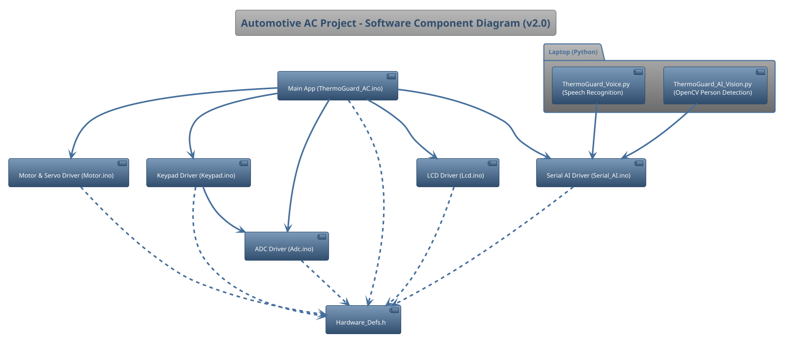
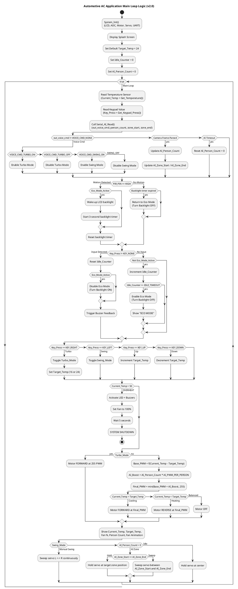
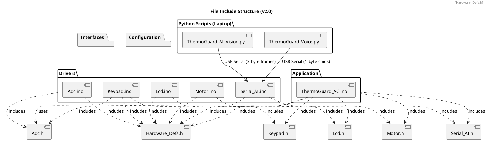

# ThermoGuard AC

| **Author**              | `Ali Akram - Mahmoud Adgham - Ziad Khalil`                                       |
|:------------------------|:-----------------------------------------------------|
| **Status**              | `Release`                          |
| **Version**             | `2.0`                                                |
| **Date**                | `9/12/2025`                                         |

## Introduction

This document provides the detailed software design for the "Automotive Air Conditioning Control Panel" (ThermoGuard) project. This system is developed for the AVR ATmega328P microcontroller as part of the KH5023FTE Embedded System Design & Development module.

### Purpose

This project aims to build a reliable electronic system that functions as a complete automotive air conditioning control panel. It serves as the central processing unit that links user inputs to the physical cooling hardware. The system has six main goals:

1.  **Monitor and Display:** The system will constantly measure the current ambient temperature using an analog sensor (ADC) and clearly show the temperature, system status, and animations on the LCD screen.
2.  **Allow User Configuration:** The system will watch the KeyPad for button presses to adjust the Target Temperature, toggle "Turbo Mode" (Max Cooling), and toggle "Swing Mode" (Air Flow Distribution).
3.  **Regulate Temperature:** The system will automatically control the Fan (Motor) speed and direction to adjust the environment until it matches the temperature the user requested.
4.  **Safety & Efficiency:** The system will monitor for critical overheating to trigger emergency shutdown procedures and dim the display (Eco Mode) during periods of inactivity to save power.
5.  **AI-Driven Occupancy Control:** A laptop-side Python script uses a webcam and computer vision (OpenCV HOG+SVM and Haar Cascade) to count detected persons in the room and identify which zone (Left / Centre / Right) they occupy. This data is sent over a serial link to the Arduino, which adjusts fan speed proportionally to occupancy and directs the servo swing toward the occupied zone.
6.  **Voice Control:** A second Python script on the laptop captures microphone input and performs speech recognition to translate spoken commands ("Turbo On", "Turbo Off", "Swing On", "Swing Off") into single-byte serial codes that the Arduino processes in real time—allowing the user to control the system hands-free without a physical remote.

### Scope

According to the project brief and the architectural requirements, this detailed design's scope is limited to five primary use cases that cover environmental control, safety, user interaction, occupancy-based automation, and voice-driven control:

**`Use Case #1`: Climate Monitoring and Automated Control**
The system will continuously acquire and process ambient temperature data using the ADC module. It will take the digitized value, convert it to degrees Celsius, and display the result. Simultaneously, the system will automatically regulate the DC Fan Motor's speed and direction. It also manages a Servo Motor to oscillate air vents (Swing Mode) when requested.

**`Use Case #2`: User Configuration**
The system will monitor the KeyPad for user input. It allows the user to configure the Target Temperature (Up/Down), toggle "Turbo Mode" for instant cooling (Right Key), and toggle "Swing Mode" for air distribution (Left Key).

**`Use Case #3`: Safety and Energy Management**
The system monitors for critical failure states. If the temperature exceeds 50°C, it triggers an "Emergency Shutdown" (Alarm + Max Fan + Halt). Additionally, if no user input is detected for a set duration, the system enters "Eco Mode" by turning off the LCD backlight. A PIR (Passive Infrared) motion sensor is also integrated: when motion is detected, the LCD backlight is restored for 3 seconds before returning to Eco Mode, preventing the backlight from staying on unnecessarily while still reacting to occupant presence.

**`Use Case #4`: AI Vision — Occupancy-Based Fan & Servo Control**
A laptop-side Python script (`ThermoGuard_AI_Vision.py`) captures webcam frames and runs dual-mode person detection (HOG+SVM body detector and Haar Cascade face detector). It smooths the detected count over a 5-frame voting buffer and sends a 3-byte serial command to the Arduino every 500 ms: the person count (0–6), the leftmost occupied zone, and the rightmost occupied zone. The Arduino boosts fan PWM proportionally to the person count and directs (or sweeps) the servo between the reported zones. If the serial link is lost, the system times out after `AI_TIMEOUT_LOOPS` iterations and resets the AI influence to zero.

**`Use Case #5`: Voice Control**
A second laptop-side Python script (`ThermoGuard_Voice.py`) listens to the microphone and performs speech recognition. On a valid command match, it transmits a single-byte code over the same serial port: `'T'` (Turbo ON), `'t'` (Turbo OFF), `'S'` (Swing ON), or `'s'` (Swing OFF). The Arduino's Serial AI driver handles voice bytes in its idle parse state, ensuring they are never mis-interpreted as camera zone bytes.

Native C programming must be used to complete the embedded side of the project; no external libraries or Arduino-based code may be used.

## Architectural Overview

This section describes where this module resides in the context of the software architecture.

```plantuml

@startuml
title Automotive AC Project - Software Component Diagram (v2.0)
!theme spacelab

' --- Python-side components (Laptop) ---
package "Laptop (Python)" {
    component [ThermoGuard_AI_Vision.py\n(OpenCV Person Detection)] as Vision
    component [ThermoGuard_Voice.py\n(Speech Recognition)] as Voice
}

' --- Arduino-side components ---
component [Main App (ThermoGuard_AC.ino)] as Main
component [LCD Driver (Lcd.ino)] as LCD
component [ADC Driver (Adc.ino)] as ADC
component [Keypad Driver (Keypad.ino)] as Keypad
component [Motor & Servo Driver (Motor.ino)] as Motor
component [Serial AI Driver (Serial_AI.ino)] as SerialAI
database [Hardware_Defs.h] as HW_Defs

' --- Laptop -> Arduino communication ---
Vision --> SerialAI : USB Serial\n(3-byte: count+zone_start+zone_end)
Voice  --> SerialAI : USB Serial\n(1-byte: T/t/S/s)

' --- Main Application Relationships ---
Main --> LCD      : Uses (Display & Animation)
Main --> ADC      : Uses (Get_Temperature)
Main --> Keypad   : Uses (Get_Keypad_Press)
Main --> Motor    : Uses (Fan Speed & Servo Pulse)
Main --> SerialAI : Uses (Serial_AI_Read)
Main ..> HW_Defs  : Includes

' --- Driver-to-Driver Relationships ---
Keypad --> ADC : Uses (Adc_Read)

' --- Hardware Definition Dependencies ---
Motor    ..> HW_Defs : Includes
LCD      ..> HW_Defs : Includes
ADC      ..> HW_Defs : Includes
Keypad   ..> HW_Defs : Includes
SerialAI ..> HW_Defs : Includes

@enduml


```

## Assumptions & Constraints
### Assumptions
* **Microcontroller:** The code is written for an **AVR ATmega328P** microcontroller.
* **System Clock:** The system clock frequency (`F_CPU`) is **16MHz**. This is critical for `_delay_ms()` timing and the ADC prescaler settings.
* **Hardware Connections:**  All components (LCD, DC Motor, Servo, Keypad, LM35, Buzzers, PIR Sensor) are connected to the exact ports and pins defined in `Hardware_Defs.h`.
* **ADC Configuration:** The ADC uses AVcc for Keypad reading, but switches to the internal 1.1V reference for the LM35 Temp Sensor to ensure precision.
* **Servo Timing:** The Servo motor is controlled via software PWM nested inside the main loop timing to avoid conflicts with the Motor PWM timer.
* **AI Serial Link:** Both the Vision and Voice Python scripts share the same USB-Serial port. The `Serial_AI` driver uses a stateful parser to distinguish 3-byte camera sequences from single-byte voice commands and heartbeat bytes without collision.
* **Webcam & Microphone:** A standard USB webcam and microphone are assumed to be connected to the laptop running the Python scripts.
* **PIR Sensor:** The PIR sensor output is a digital HIGH/LOW signal connected to a dedicated input pin on the Arduino. It operates in retriggerable mode; the firmware enforces the 3-second backlight window in software.

### Constraints
* **Native C:** The application must be written in **Native C**, without using any Arduino-based functions or libraries.
* **Direct Register Access:** All peripherals (`Ports, ADC, Timers, UART`) must be controlled via direct register manipulation.
* **Input Logic:** The system must handle multiple logic layers: Turbo Mode (`Right Key` or Voice `'T'`), Swing Mode (`Left Key` or Voice `'S'`), and Temperature (`Up/Down`).
* **Safety Priority:** The Overheat check must take precedence over all other logic; if >50°C, the system must lock down.
* **Serial Protocol Integrity:** Voice single-byte commands (`T`, `t`, `S`, `s`) must never be processed while the parser is mid-sequence waiting for zone bytes. They are only accepted in the idle parse state (state 0).
* **AI PWM Cap:** The AI-driven PWM boost is clamped to `AI_MAX_PERSONS × AI_PWM_PER_PERSON` to prevent runaway fan speed in case of false detections.

## Functional Description
The system runs on one continuous loop that manages all its core activities. This loop has four primary jobs:

1.  **Monitor & Interface:** The system constantly reads the ambient temperature using the ADC and updates the LCD screen with real-time data, fan animation frames, and operational modes (Cooling, Heating, Turbo, or Eco).
2.  **Handle User Input & Safety:** It continuously checks the analog keypad to detect user commands (Temp adjustment, Turbo, Swing), polls the PIR sensor for motion to manage backlight wake-up, monitors for critical safety thresholds to prevent overheating, and checks for incoming voice commands from the serial link.
3.  **Actuation & Control:** The system regulates the DC Motor's speed and direction based on the temperature logic, applies an additional AI-driven PWM boost proportional to the number of detected persons, and controls the Servo motor to target or sweep across the occupied zone.
4.  **AI Serial Processing:** Every loop iteration, the system calls `Serial_AI_Read()` to drain any available UART bytes. Camera frames update person count and zone targets. Voice bytes directly toggle Turbo or Swing modes. A timeout counter resets the AI influence if the Python scripts stop sending data.

#### This section provides a more detailed illustration of the application's logic.

### 1. One-Time Setup
* Initialize the LCD, ADC, Motor, Servo, and Serial AI (`UART`) drivers.
* Display a "SYSTEM LOADING" splash screen with a progress bar animation.
* Set the default Target Temperature (24°C) and initialize system state variables.
* Configure the PIR sensor pin as a digital input.

### 2. The Main Loop (Repeats Forever)
* **Read Inputs:** Get the current temperature value (from the LM35 sensor) and check which button (if any) is pressed on the keypad.
* **Process Serial AI Data:** Call `Serial_AI_Read()` to consume any available UART byte.
    * If a **camera frame** was parsed, update `AI_Person_Count`, `AI_Zone_Start`, and `AI_Zone_End`.
    * If a **voice command** byte was received, immediately apply the corresponding action: toggle Turbo (`'T'`/`'t'`) or Swing (`'S'`/`'s'`) mode.
    * If **no data** has been received for `AI_TIMEOUT_LOOPS` iterations, reset person count to 0.
* **PIR Motion Detection:**
    * Read the PIR sensor digital pin each loop.
    * If motion is detected and the system is in **Eco Mode**, wake up the LCD backlight for 3 seconds, then return to Eco Mode automatically.
    * If motion is detected while the system is already active, reset the backlight-on timer.
* **Power Management (Eco Mode):**
    * If no keypad buttons are pressed for the `IDLE_TIMEOUT` period, enter **Eco Mode** (turn off LCD backlight and display "ECO MODE").
    * If a keypad button is pressed, **Wake Up** the system, turn on the backlight, and trigger a dual-buzzer pulse for feedback.
* **Process Keypad Commands:**
    * If the **UP** button is pressed, increase the Target Temperature by 1°C.
    * If the **DOWN** button is pressed, decrease the Target Temperature by 1°C.
    * If the **RIGHT** button is pressed, toggle **Turbo Mode** (sets Target to 16°C and Fan to Max).
    * If the **LEFT** button is pressed, toggle **Swing Mode** (enables Servo oscillation).
* **Emergency Logic:** If Current Temperature > 50°C, trigger **Overheat Protocol**. Activate LED and Buzzers, run Fan at 100%, and after a 5-second cooldown, strictly **Shutdown** the system.
* **Calculate Control:** Calculate the difference between Current Temperature and Target Temperature.
    * **Cooling:** If Current > Target, turn Motor **Forward** with speed proportional to the error.
    * **Heating:** If Current < Target, turn Motor **Reverse** with speed proportional to the error.
    * **Turbo:** Force Motor **Forward** at Maximum Speed (255 PWM) regardless of temperature.
    * **AI Boost:** Add `AI_Person_Count × AI_PWM_PER_PERSON` to the base PWM (capped at 255) when persons are detected.
* **Show Status:** Update the LCD to show the Current Temp, Target Temp, Fan speed percentage, person count (if AI active), and animate the custom fan characters.
* **Servo Actuation:** Execute a 200 ms timing block that services the Servo State Machine.
    * In **manual Swing Mode**, the servo sweeps left-to-right continuously.
    * In **AI Zone Mode** (persons detected, Swing Mode off), the servo targets or sweeps between `AI_Zone_Start` and `AI_Zone_End` as instructed by the vision script.
    * When `AI_Zone_Start == AI_Zone_End`, the servo holds the single target position.

#### Application Logic Flow

```plantuml

@startuml
title Automotive AC Application Main Loop Logic (v2.0)

start
:System_Init()
(LCD, ADC, Motor, Servo, UART);
:Display Splash Screen;
:Set Default Target_Temp = 24;
:Set Idle_Counter = 0;
:Set AI_Person_Count = 0;

while (true) is (Main Loop)
    :Read Temperature Sensor
    (Current_Temp = Get_Temperature());
    :Read Keypad Value
    (Key_Press = Get_Keypad_Press());

    ' --- Serial AI Processing ---
    :Call Serial_AI_Read()
    (out_voice_cmd, person_count, zone_start, zone_end);
    if (out_voice_cmd != VOICE_CMD_NONE) then (Voice Cmd)
        if (VOICE_CMD_TURBO_ON) then
            :Enable Turbo Mode;
        elseif (VOICE_CMD_TURBO_OFF) then
            :Disable Turbo Mode;
        elseif (VOICE_CMD_SWING_ON) then
            :Enable Swing Mode;
        else (SWING_OFF)
            :Disable Swing Mode;
        endif
    elseif (Camera Frame Parsed) then (yes)
        :Update AI_Person_Count;
        :Update AI_Zone_Start / AI_Zone_End;
    elseif (AI Timeout) then (yes)
        :Reset AI_Person_Count = 0;
    endif

    ' --- PIR Motion Detection ---
    if (PIR_PIN == HIGH) then (Motion Detected)
        if (Eco_Mode_Active) then (yes)
            :Wake up LCD backlight;
            :Start 3-second backlight timer;
        endif
        :Reset backlight timer;
    else (No Motion)
        if (Backlight timer expired) then (yes)
            :Return to Eco Mode
            (Turn Backlight OFF);
        endif
    endif

    ' --- Input & Eco Mode Logic ---
    if (Key_Press != KEY_NONE) then (Input Detected)
        :Reset Idle_Counter;
        if (Eco_Mode_Active) then (yes)
            :Disable Eco Mode
            (Turn Backlight ON);
        endif
        :Trigger Buzzer Feedback;
    else (No Input)
        if (Not Eco_Mode_Active) then (yes)
            :Increment Idle_Counter;
            if (Idle_Counter >= IDLE_TIMEOUT) then (yes)
                :Enable Eco Mode
                (Turn Backlight OFF);
                :Show "ECO MODE";
            endif
        endif
    endif

    ' --- Configuration Logic ---
    if (Key_Press == KEY_RIGHT) then (Turbo)
        :Toggle Turbo_Mode;
        :Set Target_Temp (16 or 24);
    elseif (Key_Press == KEY_LEFT) then (Swing)
        :Toggle Swing_Mode;
    elseif (Key_Press == KEY_UP) then (Up)
        :Increment Target_Temp;
    elseif (Key_Press == KEY_DOWN) then (Down)
        :Decrement Target_Temp;
    endif

    ' --- Emergency Check ---
    if (Current_Temp > 50) then (OVERHEAT)
        :Activate LED + Buzzers;
        :Set Fan to 100%;
        :Wait 5 seconds;
        :SYSTEM SHUTDOWN;
        stop
    endif

    ' --- Motor Control ---
    if (Turbo_Mode) then (yes)
        :Motor FORWARD at 255 PWM;
    else (no)
        :Base_PWM = f(Current_Temp - Target_Temp);
        :AI_Boost = AI_Person_Count * AI_PWM_PER_PERSON;
        :Final_PWM = min(Base_PWM + AI_Boost, 255);
        if (Current_Temp > Target_Temp) then (Cooling)
            :Motor FORWARD at Final_PWM;
        elseif (Current_Temp < Target_Temp) then (Heating)
            :Motor REVERSE at Final_PWM;
        else (Balanced)
            :Motor OFF;
        endif
    endif

    ' --- LCD Update ---
    :Show Current_Temp, Target_Temp,
    Fan %, Person Count, Fan Animation;

    ' --- Servo Actuation (200ms block) ---
    if (Swing_Mode) then (Manual Swing)
        :Sweep servo L <-> R continuously;
    elseif (AI_Person_Count > 0) then (AI Zone)
        if (AI_Zone_Start == AI_Zone_End) then (Hold)
            :Hold servo at target zone position;
        else (Sweep)
            :Sweep servo between
            AI_Zone_Start and AI_Zone_End;
        endif
    else (Idle)
        :Hold servo at center;
    endif

endwhile

@enduml

```

## Implementation of the Module

The project is broken into several key modules:

* **`ThermoGuard_AC.ino`**: Contains the `System_Init()` and `main()` loop, global variables for state management (Eco, Turbo, Emergency, AI person count, AI zone targets, PIR backlight timer), and all high-level application logic.
* **`Adc.ino`**: Implements the ADC driver.
    * `Adc_Init()`: Configures the ADC hardware settings (Prescaler and Reference).
    * `Get_Temperature()`: Configures the ADC for Channel 2 using the 1.1V internal reference, averages 20 samples, and returns the temperature in Celsius.
    * `Adc_Read()`: Selects the specified channel, starts a conversion, polls the `ADSC` bit until the conversion is complete, and returns the 10-bit result.
* **`Lcd.ino`**: Implements the 16x2 LCD driver in 4-bit mode.
    * `Lcd_Init()`: Performs the required 4-bit initialization sequence and enables the backlight pin.
    * `Lcd_Send_Command() / Lcd_Send_Data()`: Internal helper functions to send commands and data, respectively, by manipulating the control pins.
    * `Lcd_Load_Custom_Chars()`: Loads custom characters (Fan animations and Degree symbol) into the LCD memory.
* **`Keypad.ino`**: Implements the analog keypad driver.
    * `Get_Keypad_Press()`: Reads the raw 10-bit ADC value from the keypad channel. It then compares this value against the thresholds defined in `Hardware_defs.h` to identify and return the pressed key.
* **`Motor.ino`**: Implements the DC Motor and Servo driver.
    * `Motor_Init()`: Configures the PWM timer registers and sets the direction and servo pins as outputs.
    * `Motor_Set_Control()`: Controls the speed and direction of the fan by updating the PWM duty cycle.
    * `Servo_Send_Pulse()`: Manually modulates the servo signal pin to create precise pulses for the air swing mechanism.
* **`Serial_AI.ino`**: Implements the UART-based AI serial link driver used by both the Vision and Voice Python scripts.
    * `Serial_AI_Init()`: Configures the ATmega328P UART registers for `AI_BAUD_RATE` (9600) with no hardware flow control.
    * `Serial_AI_Read()`: Polls the UART receive buffer each loop. It runs a 3-state parser for camera frames (count byte → zone-start byte → zone-end byte) and handles single-byte voice commands (`'T'`, `'t'`, `'S'`, `'s'`) and heartbeat (`'H'`) in the idle state. Returns person count, zone targets, and an `out_voice_cmd` flag to the main application. Manages a timeout counter to detect when the Python scripts have disconnected.
* **`ThermoGuard_AI_Vision.py`** *(Laptop — Python)*: Captures webcam frames and runs dual-mode person detection.
    * **HOG+SVM body detector** (`cv2.HOGDescriptor`) for full standing bodies; applies Non-Maximum Suppression to remove duplicate detections and filters weak responses below `HOG_THRESHOLD`.
    * **Haar Cascade face detector** (`haarcascade_frontalface_default.xml`) for close-up seated people where full-body HOG is unreliable.
    * A 5-frame deque buffer smooths the raw person count to suppress flickering.
    * `get_servo_zone()` maps all detected bounding-box centroids to Left / Centre / Right thirds of the frame, then returns a 2-character zone range (`'LL'`, `'CC'`, `'RR'`, `'LC'`, `'CR'`, `'LR'`) describing the leftmost and rightmost occupied zones. The Arduino uses this range to either hold or sweep the servo.
    * Every 500 ms, the script transmits a 3-byte serial packet to the Arduino (count digit + zone-start char + zone-end char). When zero persons are detected it sends `'0'` + `'H'` (hold/reset).
* **`ThermoGuard_Voice.py`** *(Laptop — Python)*: Listens to the microphone using a speech recognition library and maps spoken commands to single-byte codes:

    | Spoken Command | Byte Sent |
    |:---|:---:|
    | "Turbo On" / "turbo on" | `'T'` |
    | "Turbo Off" / "turbo off" | `'t'` |
    | "Swing On" / "swing on" | `'S'` |
    | "Swing Off" / "swing off" | `'s'` |

    The byte is written to the same serial port used by the Vision script (only one Python script runs at a time, or they share the port through a virtual multiplexer).

## Integration and Configuration
### Static Files
All source and header files that comprise the project are listed below.

| File name | Contents |
|:---|:---|
| `ThermoGuard_AC.ino` | Main application logic, safety monitoring, PIR backlight management, AI integration, and servo timing loop. |
| `Hardware_Defs.h` | Central definitions for all hardware pins, ports, ADC thresholds, UART baud rate, AI constants, and system constants. |
| `Adc.h` | Exported interface for the ADC driver. |
| `Adc.ino` | Implementation of the ADC driver (Temp sensor and Generic read). |
| `Lcd.h` | Exported interface for the 16x2 LCD driver. |
| `Lcd.ino` | Implementation of the 4-bit LCD driver with Custom Chars and Backlight. |
| `Keypad.h` | Exported interface for the analog keypad driver. |
| `Keypad.ino` | Implementation of the keypad driver (maps ADC values to key presses). |
| `Motor.h` | Exported interface for the Motor and Servo driver. |
| `Motor.ino` | Implementation of DC Motor (PWM) and Servo (Software Pulse) control. |
| `Serial_AI.h` | Exported interface for the AI Serial Link driver, including voice command byte constants. |
| `Serial_AI.ino` | Implementation of the UART driver: 3-byte camera parser + single-byte voice command handler + timeout logic. |
| `ThermoGuard_AI_Vision.py` | Laptop-side Python script: OpenCV person detection (HOG+SVM + Haar Cascade), zone mapping, serial transmission. |
| `ThermoGuard_Voice.py` | Laptop-side Python script: microphone speech recognition, maps spoken commands to serial bytes. |

### Include Structure
This diagram illustrates the project's file include dependencies, showing how the main application (ThermoGuard_AC.ino) and various driver modules (.ino files) depend on interface (.h files) and configuration headers.

```plantuml
@startuml
title File Include Structure (v2.0)

package "Application" {
    component [ThermoGuard_AC.ino] as MainApp
}

package "Drivers" {
    component [Keypad.ino]
    component [Lcd.ino]
    component [Adc.ino]
    component [Motor.ino]
    component [Serial_AI.ino]
}

package "Interfaces" {
    header [Keypad.h]
    header [Lcd.h]
    header [Adc.h]
    header [Motor.h]
    header [Serial_AI.h]
}

package "Configuration" {
    header [Hardware_Defs.h]
}

package "Python Scripts (Laptop)" {
    component [ThermoGuard_AI_Vision.py]
    component [ThermoGuard_Voice.py]
}

' --- Relationships ---
[MainApp] ..> [Hardware_Defs.h]  : includes
[MainApp] ..> [Adc.h]           : includes
[MainApp] ..> [Lcd.h]           : includes
[MainApp] ..> [Keypad.h]        : includes
[MainApp] ..> [Motor.h]         : includes
[MainApp] ..> [Serial_AI.h]     : includes

[Keypad.ino]    ..> [Keypad.h]      : includes
[Keypad.ino]    ..> [Hardware_Defs.h]: includes
[Keypad.ino]    ..> [Adc.h]         : uses

[Lcd.ino]       ..> [Lcd.h]         : includes
[Lcd.ino]       ..> [Hardware_Defs.h]: includes

[Adc.ino]       ..> [Adc.h]         : includes
[Adc.ino]       ..> [Hardware_Defs.h]: includes

[Motor.ino]     ..> [Motor.h]        : includes
[Motor.ino]     ..> [Hardware_Defs.h]: includes

[Serial_AI.ino] ..> [Serial_AI.h]    : includes
[Serial_AI.ino] ..> [Hardware_Defs.h]: includes

[ThermoGuard_AI_Vision.py] --> [Serial_AI.ino] : USB Serial (3-byte frames)
[ThermoGuard_Voice.py]     --> [Serial_AI.ino] : USB Serial (1-byte cmds)

@enduml

```

### Configuration
All hardware and application-level constants are defined in `Hardware_Defs.h` for easy configuration.

| Name | Value | Description |
|:---|:---|:---|
| **LCD Configuration** | | |
| `LCD_RS_PIN` | 0 (PB0) | Register Select Pin |
| `LCD_E_PIN` | 1 (PB1) | Pin for LCD Enable |
| `LCD_BL_PIN` | 2 (PB2) | Pin for Backlight Control (Eco Mode) |
| `LCD_DATA_PORT` | PORTD | Port for LCD Data Lines (D4-D7) |
| **Actuators & Alarm** | | |
| `MOTOR_PWM_PIN` | 3 (PD3) | DC Motor Speed (Timer 2) |
| `MOTOR_DIR_PINS` | 4, 5 (PB4, PB5) | DC Motor Direction Control |
| `SERVO_PIN` | 1 (PC1) | Servo Motor Signal Pin |
| `LED_PIN` | 2 (PD2) | Emergency Warning LED |
| `BUZZER1_PIN` | 3 (PB3) | Primary Buzzer |
| `BUZZER2_PIN` | 3 (PC3) | Secondary Buzzer |
| **ADC Channels** | | |
| `KEYPAD_CH` | 0 | Channel for Keypad |
| `TEMP_CH` | 2 | ADC Channel for LM35 |
| **Keypad Thresholds** | *(10-bit ADC)* | |
| `KEY_RIGHT` | < 60 | Threshold for Right key (Turbo) |
| `KEY_UP` | < 200 | Threshold for Up key |
| `KEY_DOWN` | < 400 | Threshold for Down key |
| `KEY_LEFT` | < 600 | Threshold for Left key (Swing) |
| `KEY_SELECT` | < 800 | Threshold for Select key |
| **AI Serial Link** | | |
| `AI_BAUD_RATE` | 9600 | UART baud rate for Python↔Arduino link |
| `AI_PWM_PER_PERSON` | 38 | PWM boost added per detected person (~15% of 255) |
| `AI_MAX_PERSONS` | 6 | Maximum detectable persons (caps PWM boost) |
| `AI_TIMEOUT_LOOPS` | 30 | Loop iterations before AI link is considered lost |
| **Servo Zone Positions** | *(microseconds)* | |
| `SERVO_ZONE_LEFT` | 1000 µs | Servo pulse for Left zone |
| `SERVO_ZONE_CENTER` | 1250 µs | Servo pulse for Centre zone |
| `SERVO_ZONE_RIGHT` | 1500 µs | Servo pulse for Right zone |
| **Voice Command Codes** | *(Serial_AI.h)* | |
| `VOICE_CMD_NONE` | 0 | No voice command received |
| `VOICE_CMD_TURBO_ON` | 1 | Byte `'T'` received — enable Turbo |
| `VOICE_CMD_TURBO_OFF` | 2 | Byte `'t'` received — disable Turbo |
| `VOICE_CMD_SWING_ON` | 3 | Byte `'S'` received — enable Swing |
| `VOICE_CMD_SWING_OFF` | 4 | Byte `'s'` received — disable Swing |
| **PIR Sensor** | | |
| `PIR_PIN` | *(TBD in Hardware_Defs.h)* | Digital input pin connected to PIR sensor output |
| `PIR_BACKLIGHT_SEC` | 3 | Seconds the backlight stays on after PIR trigger |
